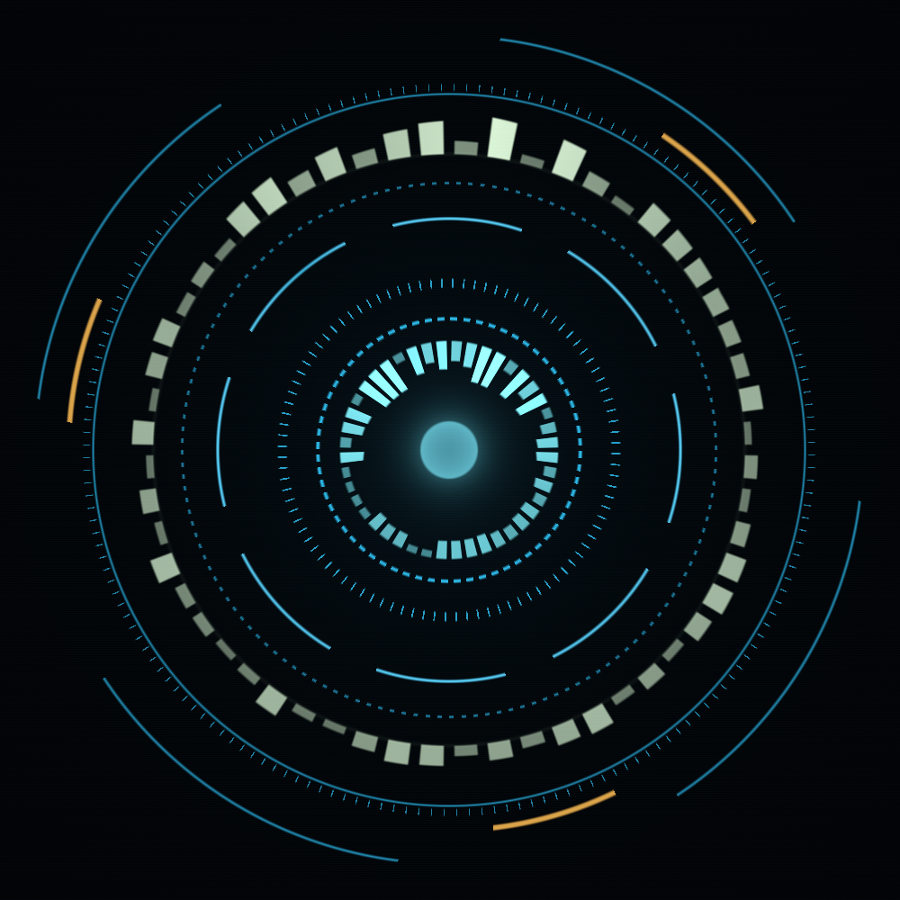

# Ada

Always-on agentic desktop assistant with a visible presence: a procedural
avatar (Zig + sokol) that reacts to what she hears (your voice) and what
she says (hers). Inspired by Siri; built on the local stack:
perception-voice (Whisper STT), presence-voice (Piper/Kokoro TTS),
lm-studio (`google/gemma-4-e4b`), and agl-ai.

<p align="center">
  
</p>
<p align="center"><em><code>--style hud</code> mid-conversation (outer bars: your voice · inner ring + core: hers · amber brackets: engaged) — and the default orb.</em></p>

Design doc: [docs/PLAN.md](docs/PLAN.md) · wire spec: [docs/PROTOCOL.md](docs/PROTOCOL.md)

## Pieces

- **`ada avatar`** (Zig + sokol) — borderless orb window. All animation is
  one fragment shader driven by smoothed uniforms: state crossfades
  (idle/listening/active/thinking/speaking), your voice's spectral bands on
  the halo, her voice on the core. `WM_CLASS = "ada"` so awesome-WM rules
  own placement ([docs/rc.lua.example](docs/rc.lua.example)).
- **`back/ada-back.coffee`** (Bun CoffeeScript + agl-ai) — the conversation loop:
  perception-voice `subscribe words` push stream (partials + finals) →
  activation gate → streamed LLM turn → per-sentence TTS. Tools:
  conversation, home lights (govee/openrgb), mari activities (apps +
  commands from `/workspace/mari/activity/*.yml`).

## Run

```
zig build                        # → zig-out/bin/ada
systemctl --user start ada-back # or: cd back && bun ada-back.coffee
ada avatar                       # holographic reticle (fails fast if services are down)
ada avatar --style orb           # alt style: the glowing liquid orb
ada avatar --solo                # no services: 1-5 toggle states, space pulse
```

Orb input: **hold left button = push-to-talk**, short click = cancel,
`q`/`esc` quit. Voice activation: say "Ada …" (transcript matching), plus
an 8 s conversation window after each exchange for follow-ups.

## Install

```
zig build -Doptimize=ReleaseSafe
cp zig-out/bin/ada ~/.local/bin/
(cd back && bun install)
cp ada-back.service ~/.config/systemd/user/
systemctl --user daemon-reload && systemctl --user enable --now ada-back
```

Requires running: `perception-voice` (with the `subscribe` streaming
interface, deployed), `voice serve` (presence-voice v2), lm-studio on
:1234 with `google/gemma-4-e4b` loaded.

## Back env knobs

| var | default |
|---|---|
| `ADA_VOICE` | `ada` (presence-voice preset) |
| `ADA_MODEL` | `lm-studio:google/gemma-4-e4b` |
| `ADA_WAKE` | `\bada\b` |
| `ADA_CONV_WINDOW_MS` | `8000` |
| `ADA_BACK_SOCK` | `$XDG_RUNTIME_DIR/ada-back.sock` |
| `ADA_SOUL` | `SOUL.md` (repo root) — standing knowledge loaded into her system prompt at startup |
| `ADA_SELFTEST` | unset — set to a phrase to run one synthetic turn (no mic) |

## Status / deferred

- presence-voice feature frames (`subscribe levels` on the TTS daemon) are
  **requested, not landed** (`/workspace/voice/tmp/ADA_FEATURE_FRAMES_REQUEST.md`);
  until then the orb synthesizes the speaking pulse from state events and
  auto-upgrades when the daemon starts answering.
- Per-pixel transparency / click-through orb: stretch goal (plan §4).
- Speculative turn-start on partials: latency pass (plan milestone 6).
