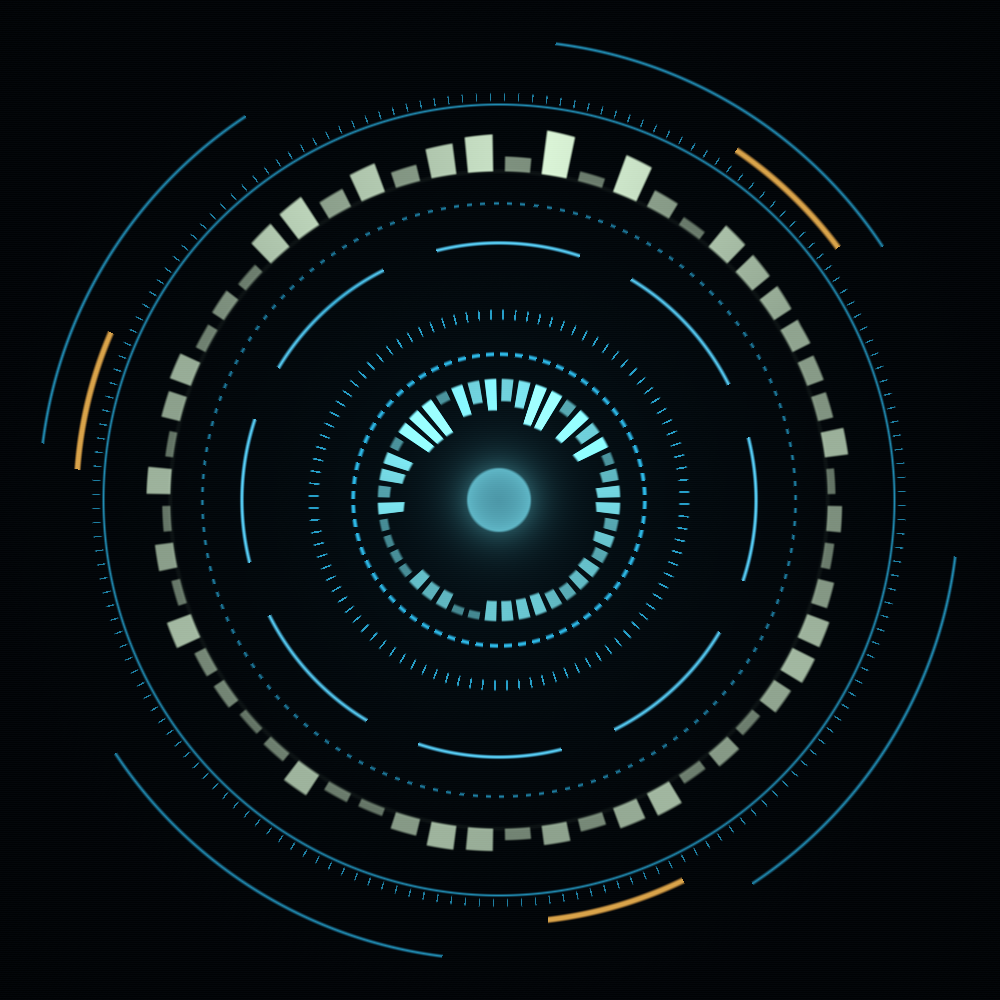

# Ada

Always-on agentic desktop assistant with a visible presence: a procedural
avatar (Zig + sokol) that reacts to what she hears (your voice) and what
she says (hers). Inspired by Siri; built on the local stack:
perception-voice (Whisper STT), presence-voice (Piper/Kokoro TTS),
lm-studio (`google/gemma-4-26b-a4b-qat`), and agl-ai.

<p align="center">
  
</p>
<p align="center"><em><code>--style hud</code> mid-conversation (outer bars: your voice · inner ring + core: hers · amber brackets: engaged) — and the default orb.</em></p>

Design doc: [docs/PLAN.md](docs/PLAN.md) · wire spec: [docs/PROTOCOL.md](docs/PROTOCOL.md)

## Pieces

- **`ada avatar`** (Zig + sokol) — borderless orb window. All animation is
  one fragment shader driven by smoothed uniforms: state crossfades
  (idle/listening/active/thinking/speaking), your voice's spectral bands on
  the halo, her voice on the core. `WM_CLASS = "ada"` so awesome-WM rules
  own placement ([docs/rc.lua.example](docs/rc.lua.example)).
- **`back/ada-back.coffee`** (Bun CoffeeScript + **Angela** + agl-ai) — the
  conversation loop: perception-voice words stream → wake/PTT gate (or
  `listen` tool) → Angela `session.run` (retained context in
  `.angela/sessions/`) → per-sentence TTS. House tools are an MCP stdio
  server (`back/mcp/home`); brain and todo are existing MCP servers.

## Run

```
zig build                        # → zig-out/bin/ada
systemctl --user start ada-back # or: cd back && bun ada-back.coffee
ada avatar                       # holographic reticle (fails fast if services are down)
ada avatar --style orb           # alt style: the glowing liquid orb
ada avatar --solo                # no services: 1-5 toggle states, space pulse
```

Orb input: **hold left button = push-to-talk** (talk until you release —
no max hold), short click = cancel
listen if she is actively listening (wake-word gathering or `listen`
tool), otherwise cancel speech / the turn. While Tom is waiting, a
**green check / red X** appear under the rec pip — click to approve or
deny that challenge (voice still works). The avatar ignores the
keyboard in production (voice-keyboard STT was closing it); `q`/`esc`
quit only in `--solo`. Voice activation: say "Ada …" (transcript
matching). She does not keep listening after she answers unless she
calls the `listen` tool.

## Install

```
zig build -Doptimize=ReleaseSafe
cp zig-out/bin/ada ~/.local/bin/
(cd back && bun install)
cp ada-back.service ~/.config/systemd/user/
systemctl --user daemon-reload && systemctl --user enable --now ada-back
```

Requires running: `perception-voice` (with the `subscribe` streaming
interface, deployed), `voice serve` (presence-voice v2), llama-server or
LM Studio on :1234 with `google/gemma-4-12b-qat` loaded (`FAV_LOCAL_LLM`).

## config.yaml

User-tunable settings that are nicer to hand-edit than an env var live in
[config.yaml](config.yaml) (repo root) — currently just `voice`, the
presence-voice preset name (see `voices:` in `/workspace/voice/config.yaml`
for the full list). Edit it and `systemctl --user restart ada-back` to
apply. Every key doubles as an env var (below) for one-off overrides
without touching the file — the env var always wins when set.

## Back env knobs

| var | default |
|---|---|
| `ADA_VOICE` | `config.yaml`'s `voice`, else `ada` (presence-voice preset) |
| `ADA_MODEL` | `$FAV_LOCAL_LLM` |
| `ADA_WAKE` | `\bada\b` |
| `ADA_LISTEN_TIMEOUT` | `6` (seconds to wait for speech to *start* on `listen`) |
| `ADA_MAX_TURNS` | `config.yaml` `max_turns`, else `20` (agl rounds per Ada `session.run`) |
| `ADA_BACK_SOCK` | `$XDG_RUNTIME_DIR/ada-back.sock` |
| `ADA_VOICE_SOCK` | `$XDG_RUNTIME_DIR/ada-voice.sock` (home MCP `listen` shim) |
| `ADA_SOUL` | `SOUL.md` (repo root) — standing knowledge loaded into her system prompt at startup |
| `ADA_CONFIG` | `config.yaml` (repo root) |
| `ADA_SELFTEST` | unset — set to a phrase to run one synthetic turn (no mic) |

## Status / deferred

- presence-voice feature frames (`subscribe levels` on the TTS daemon) are
  **requested, not landed** (`/workspace/voice/tmp/ADA_FEATURE_FRAMES_REQUEST.md`);
  until then the orb synthesizes the speaking pulse from state events and
  auto-upgrades when the daemon starts answering.
- Per-pixel transparency / click-through orb: stretch goal (plan §4).
- Speculative turn-start on partials: latency pass (plan milestone 6).
