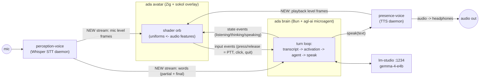

> Historical note: the component this draft calls the "brain" was renamed
> to **"back"** (2026-07-05) to avoid confusion with github.com/mikesmullin/brain.

# Ada — plan (DRAFT, for iteration)

Status: **draft for discussion — nothing approved for implementation.**
Implementation will happen later, in a fresh `/workspace/ada/` session.

Ada is an always-on agentic virtual assistant (inspired by Siri) with a
visible presence on the desktop: a glowing orb, rendered in real time,
that reacts to what she hears (your voice) and what she says (her voice).

## 1. Decisions so far (from Q&A)

| Topic | Decision |
|---|---|
| Split | **Zig face + Bun brain**: `ada avatar` (Zig + **sokol**) renders; a separate agl-ai microagent process runs the conversation loop |
| Visuals | **Procedural shader orb** — no sprites, no keyframes; audio features drive shader uniforms |
| Window | **Borderless always-on-top overlay** — v1: small opaque floating window managed by awesome-WM client rules; per-pixel transparency is a stretch goal via a small sokol_app patch (see §4) |
| Rendering | **zig + sokol** (`floooh/sokol-zig` official bindings; `sokol_app` window/input, `sokol_gfx` GL backend on Linux, orb shader written once and cross-compiled by `sokol-shdc`). Buys Windows/macOS compatibility for later without testing it now; see `tmp/GROK_ZIG_SOKOL.md` |
| TTS animation source | **presence-voice streams to the avatar**; also open to a lower-latency streaming-synthesis interface in presence-voice |
| Mic animation source | **perception-voice publishes level/feature frames** (symmetric with presence-voice; one mic owner) |
| Activation | **Mixed**: always listening, but only *activated* by (a) name/keyword ("Ada …"), or (b) press-and-hold on the orb (push-to-talk while mouse button is down) |
| Echo | **Headphones assumption** — no AEC, no self-transcript filtering in v1 (revisit if she ever plays through speakers) |
| Brain LLM | **Local via lm-studio** (`google/gemma-4-e4b`, same as home.mjs — already loaded on this box) |
| Priority | **Lowest possible end-to-end latency**; **sub-500 ms would be awesome**. Start with a latency POC (milestone 0) and pull the streaming work forward as needed to chase it (see §7 budget) |
| v1 toolset | **Three things**: (1) conversation, (2) home.mjs light tools, (3) mari home + work activities — aliased shell commands, launching desktop apps, interacting with the work laptop |
| Brain supervision | **Fail fast** — `ada avatar` errors clearly if the brain/services aren't up (same philosophy as `voice client`); systemd user units keep them up |
| Orb input | **Left-press-and-hold = talk** (PTT). No drag-to-move code: awesome WM already moves any window via winkey-drag |
| Wake word | **Transcript matching** to start (acoustic wake word deferred) |
| Zig toolchain | **Track master independently** (not pinned to presence-voice's build) |
| Placement | **Biggest screen** by default; overridable via awesome `rc.lua` — avatar sets a stable `WM_CLASS` (`"ada"`) so client rules can target it |

## 2. Cast of services (existing)

- **perception-voice** (`/workspace/perception-voice`, Python) — always-on
  Whisper STT daemon. One model in VRAM; unix socket with JSON messages.
  Its existing interface is a rolling ~30 min transcript polled via
  `get/set <uid>` read markers — **Ada will not use that** (polling
  latency). Instead we add a **new real-time streaming interface** (§5a)
  that pushes both audio feature frames *and* words as they are decoded,
  at the lowest latency the pipeline allows. The `get/set` interface
  stays for existing consumers (mari, etc.).
- **presence-voice** (`/workspace/voice`, Zig v2 in progress — "Bob") —
  always-on TTS daemon (Piper + Kokoro via ONNX Runtime; zig-phenomes G2P;
  CUDA 13 EP available per `tmp/onnx-cuda-lab/REPORT.md`). Unix socket +
  HTTP; v1 already proved chunked HTTP audio streaming (commit `68261be`).
- **agl-ai** (`/workspace/agl`, Bun) — microagent framework;
  `src/agents/home.mjs` is the reference microagent (tools + local LLM).
- **lm-studio** — local OpenAI-compatible server on `:1234`,
  `google/gemma-4-e4b` loaded.

## 3. Architecture



Three processes, four sockets. The avatar never blocks on the brain; the
brain never blocks on rendering. Everything animation-related flows as
**small fixed-rate feature frames**, not raw audio (cheap, latency-bounded,
and the avatar needs features anyway).

### Process/CLI shape

- `ada` — the Zig binary, globally installed, subcommand-style (like
  `voice`): `ada avatar` opens the window. Future: `ada …` grows more
  subcommands.
- The brain is a Bun script (`ada-brain.mjs`, an agl microagent) run as a
  systemd --user unit (like both voice services). If the brain or either
  voice service isn't reachable, `ada avatar` **fails fast** with a clear
  error (decided — §9.3); systemd keeps everything up in practice.

## 4. The orb (visual design)

Single fullscreen-quad fragment shader (SDF sphere + fbm noise), HDR-ish
glow — against the window's dark background in v1, composited by picom
over the desktop once the transparency stretch lands. Zero art assets;
everything is uniforms:

```
uniforms {
    time
    state_weights   // idle / listening / active(PTT or wake-word engaged) /
                    // thinking / speaking — crossfaded, several can be >0
    user_audio      // rms, 4 spectral bands, attack envelope   (from perception-voice)
    ada_audio       // rms, 4 spectral bands, attack envelope   (from presence-voice)
    press           // 0..1 press feedback (PTT ring)
}
```

Layered look (both can be active simultaneously since Ada listens while
speaking):

- **idle** — slow "breathing" glow, gentle noise drift
- **listening (passive)** — subtle: outer halo shimmers with your voice bands
- **active** — brighter ring; halo ripples track your speech strongly
  (bass = swell, treble = sparkle)
- **thinking** — inner swirl/orbiting particles while the LLM streams
- **speaking** — inner core pulses with *her* waveform envelope; your voice
  still modulates the outer halo at the same time

All audio-driven parameters get attack/release smoothing in the avatar (the
feature frames arrive at ~60 Hz; render at vsync).

### Window mechanics (X11 + picom)

- **Window/input/render via sokol** (`sokol_app` + `sokol_gfx`, GL core
  backend on Linux; official `floooh/sokol-zig` bindings with `sokol-shdc`
  compiling the orb shader once for every backend). This also means the
  render/input core is Windows/macOS-portable later without doing that
  testing now.
- **v1 window**: a small square window, opaque dark background, orb
  centered. Everything "overlay" about it comes free from **awesome WM
  client rules** on `WM_CLASS = "ada"` in `rc.lua`: floating, no
  border/titlebar, ontop, sticky, skip-taskbar, placement — zero window
  chrome code in the app.
- **Stretch (per-pixel transparency + click-through)**: `sokol_app`
  doesn't expose ARGB visuals, shape regions, or a public X11 window
  handle. sokol-zig builds sokol from source, so a small vendored patch
  can (a) request a 32-bit ARGB visual on X11 and (b) expose the Window
  id, letting us set the X Shape circular hit region so clicks outside
  the orb pass through (picom composites the alpha). Deferred until the
  v1 window proves the look isn't already good enough.
- **Left-press-and-hold = PTT** (`ptt_begin`/`ptt_end` to brain); single
  click = cancel/dismiss. No drag-to-move code — awesome WM's winkey-drag
  moves any window, and placement rules live in `rc.lua` (avatar sets
  `WM_CLASS = "ada"` so rules can target it).
- Activation UX borrows from `/workspace/whisper` (proven daily-driver
  patterns): sound effect feedback on activate/deactivate (it ships an
  `sfx/` set), and whisper-style **cancellation** — an input before the
  response commits discards the pending turn.
- Default: ~160 px orb on the biggest screen, corner offset; position
  overridable via `rc.lua`.

### Sokol build foundation (confirmed by Bob on Zig master)

Bob verified the whole sokol-zig stack builds and runs on
`0.17.0-dev.1252+e4b325c19` and left two working reference projects to
copy from directly when the `/workspace/ada/` repo is created:

- **`tmp/sokol-triangle-poc/`** — windowed `sokol_gfx` rendering with a
  `sokol-shdc`-compiled GLSL shader (the exact shape milestone 1 needs:
  swap the triangle for the orb's fullscreen quad).
- **`tmp/sokol-audio-poc/`** — headless `sokol.audio` callback playback
  (24 kHz mono f32). Not needed by the avatar (presence-voice owns
  playback), but proves the audio path if the avatar ever needs local
  sfx.

Known-good pins (from Bob's note — use these, not floating `#main`):

```zig
// build.zig.zon
.sokol = .{
    .url = "git+https://github.com/floooh/sokol-zig.git#fc8dcc657ee7d5c9106c3c000d14be88b4ea87f9",
    .hash = "sokol-0.1.0-pb1HKxrKNwAfEuu5wEOJo8yYNxmbsqa88hcjQ7A0NIYa",
},
.shdc = .{  // shader compiler, prebuilt binaries
    .url = "git+https://github.com/floooh/sokol-tools-bin#6801e61ab7ea64dd9369ae9ff2f46d20c61fc655",
    .hash = "sokolshdc-0.1.0-r2KZDj2ESgPeSsOrxWqONyemz4-250cFO8ZhXkEs4DrZ",
},
```

```zig
// build.zig — bindings + shader compile step
const sokol_dep = b.dependency("sokol", .{ .target = target, .optimize = optimize });
exe.root_module.addImport("sokol", sokol_dep.module("sokol"));

const sokolbuild = @import("sokol"); // sokol-zig's build.zig re-exports .shdc
const shd_step = try sokolbuild.shdc.createSourceFile(b, .{
    .shdc_dep = b.dependency("shdc", .{}),
    .input = "src/shaders/orb.glsl",
    .output = "src/shaders/orb.glsl.zig",
    .slang = .{ .glsl410 = true, .glsl300es = true, .metal_macos = true, .hlsl5 = true, .wgsl = true },
    .reflection = true,
});
exe.step.dependOn(shd_step);
```

Use the official bindings — not raw `@cImport`/translate-c (the
`@cImport` builtin is gone on master anyway, as Bob found in the ORT
work).

## 5. IPC protocols (proposed)

All line-delimited JSON over unix sockets (matching perception-voice's
existing style), except audio feature frames which are tiny fixed-size
binary structs for zero parsing cost at 60 Hz.

### 5a. Feature frame (shared by both voice services → avatar)

```
struct FeatureFrame {           // 32 bytes, little-endian, 60 Hz
    u32 magic;                  // 'AVF1'
    u32 stream_id;              // 0 = mic (user), 1 = tts (ada)
    f32 rms;                    // 0..1
    f32 band[4];                // low/low-mid/high-mid/high energies, 0..1
    f32 pitch_hint;             // optional (0 = none)
    u32 flags;                  // bit0: voice-active (VAD), bit1: stream-start, bit2: stream-end
}
```

- **perception-voice upgrade — the new streaming interface** (this is
  Ada's primary input path, replacing `get/set` polling entirely). One new
  `subscribe <channel>` command on the existing socket; a client connection
  becomes a push stream for its channel:
  - `subscribe levels` → binary FeatureFrames at ~60 Hz (computed from the
    mic buffer the daemon already holds; its VAD flag rides along free).
    Consumed by the **avatar**.
  - `subscribe words` → JSON lines, pushed the moment Whisper produces
    them — including **partial hypotheses**, not just finalized
    utterances, so the brain (and future captions) can react before the
    VAD tail closes:

    ```
    {"ev":"partial",   "ts":..., "text":"turn on the des"}
    {"ev":"utterance", "ts":..., "text":"Turn on the desk light.", "t_start":..., "t_end":...}
    ```
    Consumed by the **brain**. Separate connections per channel keeps
    binary and JSON framing from mixing.
- **presence-voice upgrade (ask Bob)**: same frame format, computed from
  the PCM it is *about to play* (aligned to the playback clock, i.e.
  delayed by the output latency so the orb's mouth matches the ears).
  Plus `speak-start`/`speak-end` events with the utterance text.

### 5b. avatar ⇄ brain (JSON lines)

```
brain -> avatar:  {"ev":"state", "listening":true, "active":false,
                   "thinking":false, "speaking":false}
                  {"ev":"caption", "who":"ada"|"user", "text":"..."}   // future: captions
avatar -> brain:  {"ev":"ptt", "down":true|false}
                  {"ev":"click"}        // single click: cancel speech / dismiss
                  {"ev":"quit"}
```

### 5c. Brain ⇄ voice services

- Words: `subscribe words` stream (§5a) from day one — no polling anywhere
  in Ada's pipeline. Partial hypotheses let the brain warm up (activation
  check, prompt assembly) before the utterance even finalizes.
- Speak: presence-voice `POST /speak` (or unix-socket equivalent in v2).
  Latency upgrade (phase 2): **streaming synthesis** — brain sends
  sentence fragments as the LLM streams; daemon synthesizes + plays each
  as it arrives (v1's `http stream` commit is the precedent; Kokoro on
  CUDA at RTF 0.015 makes per-sentence TTFB ~tens of ms).

## 6. The brain (agl microagent)

`ada-brain.mjs`, modeled on home.mjs but persistent:

1. Long-running loop; `subscribe words` stream from perception-voice.
2. **Activation gate**: utterance passes if (a) PTT was held during its
   time window, or (b) it matches the wake pattern (`/\bada\b/i` — plus a
   short "conversation window" after each exchange so follow-ups don't
   need re-addressing; duration configurable, e.g. 8 s).
3. Passing utterances → agl Agent turn (gemma-4-e4b via lm-studio),
   `parallel_tools`, streaming enabled.
4. Sentence-splitter on the token stream → speak each sentence via
   presence-voice as soon as it completes (don't wait for the full reply).
5. Emits state events to the avatar at every transition.
6. Tools (v1 scope, decided): three capability groups —
   - **conversation** (no tools; just talk),
   - **home lights** (port the home.mjs govee tools directly),
   - **mari activities, home + work** (aliased shell commands, launching
     desktop apps, work-laptop interaction — source the command/alias
     definitions from mari's activity configs rather than redefining them).

## 7. Latency budget (speech-end → first audio heard)

| Stage | v1 (words stream + blocking speak) | phase-2 (streamed TTS + speculation) |
|---|---|---|
| Whisper utterance finalization (VAD tail) | ~300–500 ms | same (tunable VAD; partials can start work earlier) |
| Words delivery to brain | ~0 (pushed) | ~0 |
| Activation check + prompt build | ~0 | ~0 (pre-warmed from partials) |
| LLM first sentence (gemma-4-e4b local) | ~300–700 ms | same (can start on high-confidence partials) |
| TTS first audio (Kokoro CUDA, per-sentence) | ~50–150 ms | ~50 ms (streamed synthesis) |
| **Total** | **~0.7–1.3 s** | **~0.4–1.0 s** |

The dominant fixed costs are Whisper's end-of-utterance detection and LLM
first-sentence time; the partial-hypothesis stream is what lets us shave
both (start the turn speculatively on partials, commit/abort when the
utterance finalizes). Both
voice models and the LLM share the 16 GB RTX 5070 Ti — VRAM check needed
(Whisper large-v3-turbo + Kokoro + gemma-4-e4b likely fits; measure).

## 8. Milestones

0. **Latency POC (no UI)** — a throwaway harness that measures the real
   end-to-end floor on this machine: mic → perception-voice (words
   stream, partials) → gemma-4-e4b first sentence → Kokoro-CUDA first
   audio sample. Instrument every stage; try the phase-2 tricks
   (speculative turn-start on partials, sentence-streamed TTS) in hack
   form. **Output: a measured number vs the sub-500 ms goal**, and a
   decision on which streaming work must be built first-class from day
   one. This de-risks the whole plan before any rendering code exists.
1. **Orb skeleton** — `ada avatar`: start by copying
   `tmp/sokol-triangle-poc/` (Bob's verified build skeleton, §4) and swap
   the triangle for the orb's fullscreen-quad shader (idle state) with
   fake (keyboard-driven) uniforms. Prove the awesome `rc.lua` rules
   (floating/ontop/borderless/placement via `WM_CLASS`) and left-hold
   PTT input events. Transparency stretch goal parked as its own
   follow-up (§4).
2. **avatar ⇄ brain socket** — state machine animates from scripted brain
   events; PTT events flow back.
3. **perception-voice streaming interface** — `subscribe levels` +
   `subscribe words` (partials included), productionizing whatever the
   POC hacked; halo follows your voice live; brain receives pushed words.
4. **First conversation** — brain loop end-to-end; wake-word + PTT
   activation; conversation + lights + mari activities as the toolset;
   headphones workflow works daily.
5. **Ada-reactive speaking** — presence-voice feature-frame stream (Bob);
   core pulses with her voice; listen+speak simultaneously.
6. **Latency pass** — land the POC's winning tricks first-class
   (sentence-streamed TTS, speculative turn-start); re-measure against
   the POC numbers.
7. **Polish** — config file, systemd user units, `ada` CLI ergonomics,
   conversation window tuning, cancel semantics, sfx feedback.

## 9. Decisions log (round 2 — all seven prior open questions resolved)

1. **Latency**: POC-first (milestone 0) to measure the achievable floor;
   **sub-500 ms is the aspiration**. Streaming design/work gets pulled
   forward as far as needed to chase it.
2. **v1 toolset**: three groups — conversation, home.mjs lights, and mari
   home + work activities (aliased shell commands, launching desktop
   apps, work-laptop interaction).
3. **Brain supervision**: **fail fast** (no auto-spawn from the avatar).
4. **Orb input**: **left-press-and-hold = talk**. No drag-to-move code;
   awesome WM's winkey-drag already moves windows. Activation UX borrows
   from `/workspace/whisper` (the proven daily-driver voice-keyboard
   tool): hotkey-toggle heritage, sfx feedback, cancel-before-commit.
   Note: whisper/perception-voice's dual-model design (`tiny.en`
   realtime + `large-v3` final) is exactly the partial/final split the
   §5a words stream exposes.
5. **Wake word**: transcript matching to start.
6. **Zig toolchain**: track master **independently** of presence-voice.
7. **Placement**: biggest screen by default; final say belongs to awesome
   `rc.lua` client rules, keyed on the avatar's `WM_CLASS = "ada"`.
